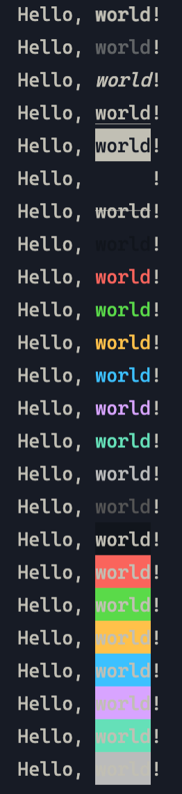

# picocolors

The tiniest for terminal output formatting with ANSI colors.

```go
fmt.Sprint("Hello, %s!", picocolors.Red("world"))
```


## styles

- `Reset`: reset style
- `Bold`, `Dim`, `Italic`, `Underline`, `Inverse`, `Hidden`, `Strikethrough`: text style
- `Black`, `Red`, `Green`, `Yellow`, `Blue`, `Magenta`, `Cyan`, `White`, `Gray`: text color
- `BgBlack`, `BgRed`, `BgGreen`, `BgYellow`, `BgBlue`, `BgMagenta`, `BgCyan`, `BgWhite`: background color



## Thanks

js library [picocolors](https://github.com/alexeyraspopov/picocolors)
